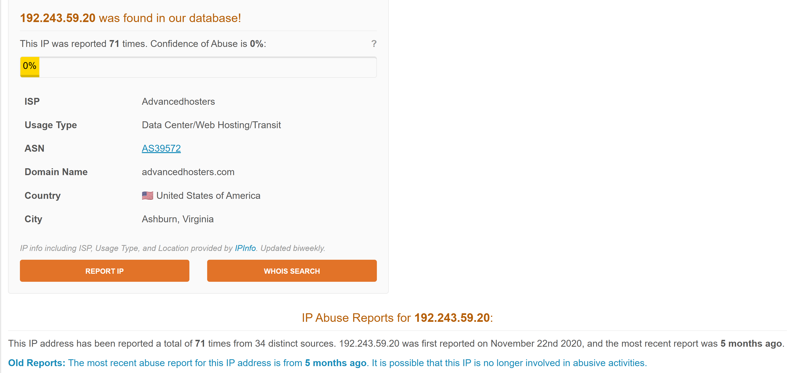

# 🛡️ Lab 01 – Malicious IP Communication Analysis

## 📌 Alert Overview

- **Source IP:** 10.2.4.33 (Internal)
- **Destination IP:** 192.243.59.20 (External)
- **Device:** Sophos Firewall
- **Event Type:** Proxy / Web Traffic
- **Status Code:** 200 (Successful connection)

---

## 🔍 Analysis

The alert indicates that an internal host initiated an outbound connection to an external IP address via web traffic.

Since the connection was successful (status code 200), the communication was allowed and completed.

This type of behavior may represent:
- Legitimate user activity (web browsing)
- Access to a potentially malicious website
- Possible malware communication (Command and Control - C2)

---

## 🌐 Threat Intelligence Analysis

### 📊 AbuseIPDB

**Analysis:**

The IP address has been reported multiple times for malicious activities such as:
- Malware distribution
- Phishing campaigns

This indicates that the IP has a **history of malicious behavior** and should be treated as suspicious.

---

### 🧪 VirusTotal

**Analysis:**

Detection rate is relatively low, but some vendors classify the domain/IP as suspicious or spam.

This suggests that:
- The threat is **not widely detected yet**
- It may represent a **new or low-confidence threat**

---

### 🌐 SecurityTrails

**Analysis:**

Using SecurityTrails, we identified domains associated with the IP address:

- pinchaturbate.com  
- (second identified domain from analysis)

This confirms that the IP address is part of hosting infrastructure and has been used to serve multiple domains.

Such behavior may indicate:
- Shared hosting environment
- Potential abuse by malicious actors

The presence of multiple domains linked to the same IP increases the suspicion level, especially when correlated with AbuseIPDB reports.

---

### 🖥️ SIEM Alert

**Analysis:**

The alert confirms:
- Outbound connection from internal host (10.2.4.33)
- Communication over web traffic
- Status code 200 → connection successful

This means the request was allowed through the firewall without being blocked.

---

## ⚠️ Conclusion

This is an **outbound connection** from an internal host to an external IP address with a suspicious reputation.

Threat intelligence sources indicate:
- Prior malicious activity reports (AbuseIPDB)
- Suspicious vendor detections (VirusTotal)
- Multiple hosted domains (SecurityTrails)

Although the detection level is not high, the combination of these indicators suggests **potential risk**.

The activity is classified as:

> ⚠️ **Suspicious but not confirmed malicious**

Further investigation is required to determine whether the activity is user-driven or related to malicious communication.

---

## 🧯 Recommendation

- Monitor the internal host (10.2.4.33) for further suspicious activity
- Review user browsing behavior
- Perform endpoint security scan
- Investigate if similar outbound connections occur repeatedly

If repeated connections to the same IP are observed (especially in short intervals), this may indicate automated communication such as malware beaconing.

In that case:

> 🚫 Blocking the IP/domain would be justified

---

## 📚 Skills Demonstrated

- SIEM Alert Analysis  
- Threat Intelligence Correlation  
- IP Reputation Analysis  
- Domain Pivoting (IP → Domain)  
- Security Investigation & Analytical Reasoning
