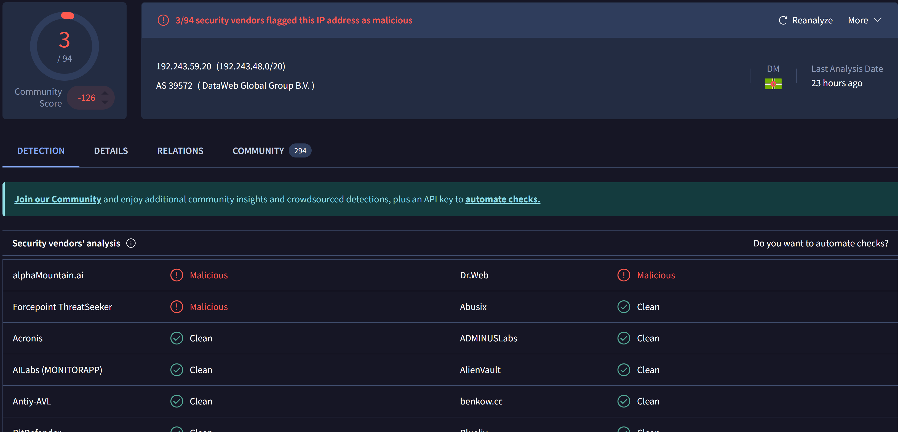
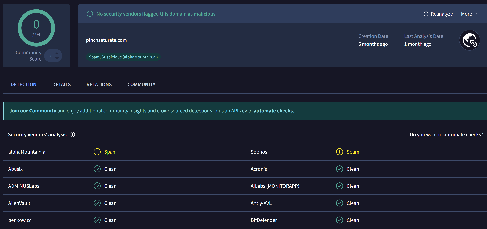
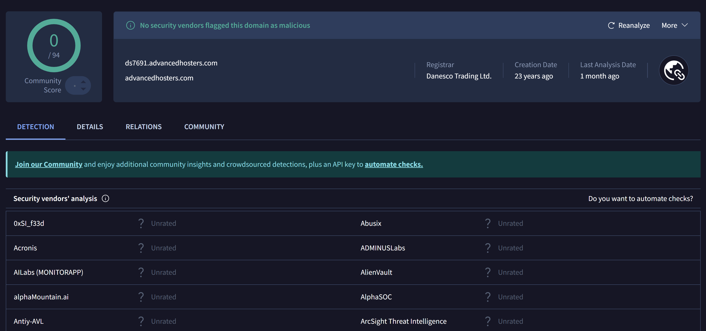
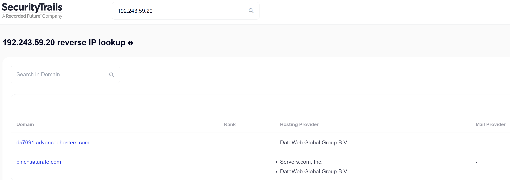

# 🔍 Malicious IP Analysis – 192.243.59.20

## 📌 Overview
This lab demonstrates the analysis of a suspicious IP address using publicly available threat intelligence tools.  
The investigation is based on screenshots provided as part of a cybersecurity training lab (not a live SIEM environment).

---

## 🧠 Executive Summary
The analyzed IP address (192.243.59.20) shows multiple indicators of malicious activity.  
It has been reported for phishing campaigns and malware distribution.

Although detection on VirusTotal is relatively low, historical abuse data and associated domains suggest suspicious behavior.

**Final Verdict: Suspicious – Monitoring recommended**

---

## 🛠️ Methodology
The following tools were used during the investigation:

- **AbuseIPDB** – for historical abuse reports
- **VirusTotal** – for detection rate analysis
- **SecurityTrails** – for identifying associated domains

---

## 🌐 AbuseIPDB Analysis

### Findings:
- IP reported **71 times**
- Reports include:
  - Malware distribution
  - Phishing activity
- Hosted by:
  - ISP: Advancedhosters
  - Type: Data Center / Web Hosting

### Interpretation:
The IP has a **history of malicious behavior**, but since it belongs to a hosting provider, it may also host legitimate services.

---

## 🦠 VirusTotal Analysis

### Findings:
- Detection rate is relatively low
- Some vendors flag the IP/domain as suspicious

### Interpretation:
- Threat is **not widely detected yet**
- Possible:
  - New threat
  - Low-confidence detection
  - Underreported activity

---

## 🌍 SecurityTrails Analysis

### Findings:
Associated domains:
- pinchaturbate.com  
- ds7691.advancedhosters.com  

### Interpretation:
- IP is part of **shared hosting infrastructure**
- Multiple domains hosted → increases uncertainty
- Malicious activity could originate from one hosted service

---

## ⚠️ Limitations
- Analysis is based on screenshots (no live data)
- No access to SIEM logs
- No network traffic validation
- Relies on third-party threat intelligence

---

## 🧾 Conclusion

The IP address shows a **confirmed history of malicious activity**, including phishing and malware distribution.

However:
- Low VirusTotal detection
- Hosting provider infrastructure

👉 indicate that this IP may be used by multiple tenants.

### ✅ Recommendation:
- Do NOT immediately block (risk of false positives)
- Monitor network traffic related to this IP
- Correlate with SIEM logs
- Investigate internal communication with this IP
- Escalate if additional indicators appear

---

## 🏁 Final Assessment
**Threat Level: Medium (Suspicious)**  
**Action: Monitoring & further investigation**
