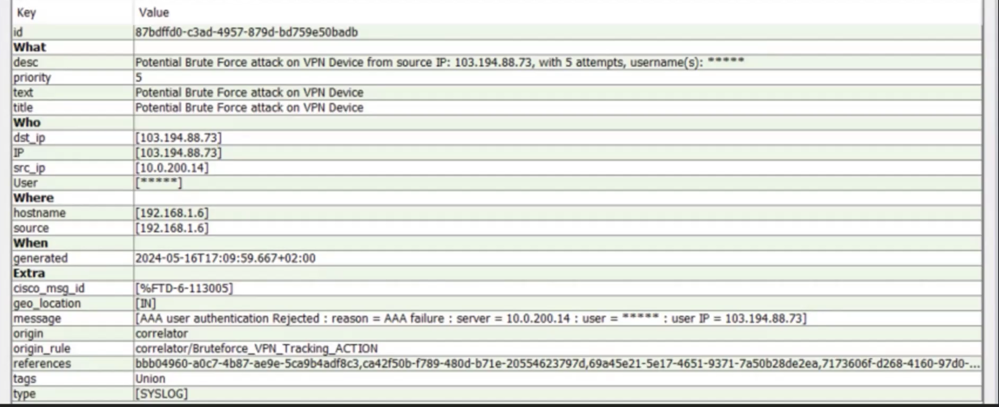
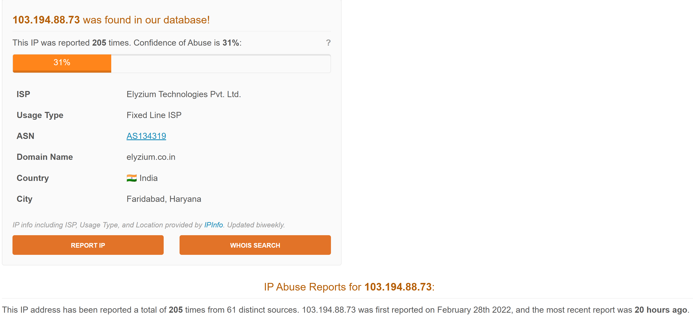
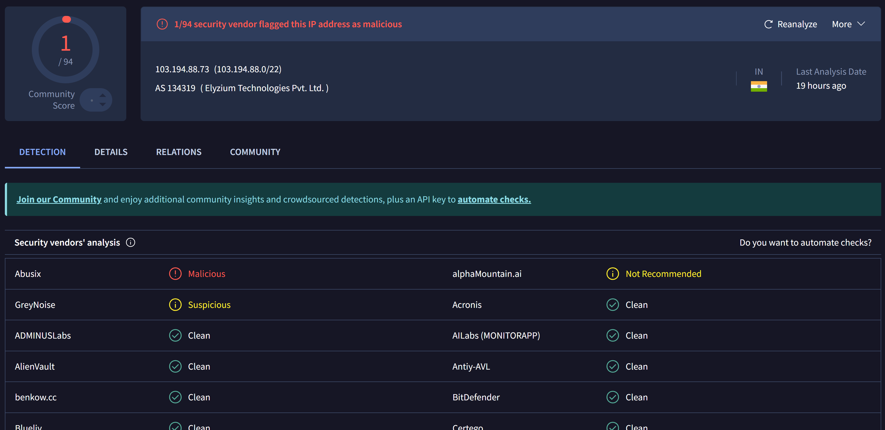
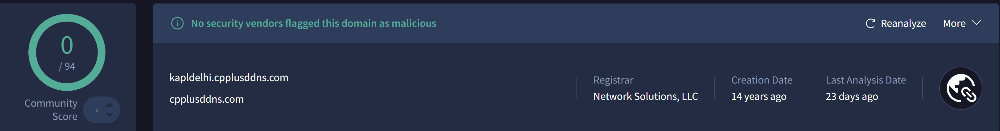

# 🔐 VPN Brute Force Attack Investigation – 103.194.88.73

## 📌 Overview
This lab demonstrates the analysis of a potential brute force attack targeting a VPN device using SIEM logs and threat intelligence tools.

---

## 🧠 Executive Summary
A potential brute force attack was detected targeting a VPN service from the external IP address **103.194.88.73**.

The attacker performed multiple login attempts (5 attempts), all of which were unsuccessful.  
Threat intelligence sources show that this IP has a history of suspicious activity.

**Final Verdict: Suspicious – Monitoring recommended**

---

## 🚨 Alert Details

- **Alert Name:** Potential Brute Force attack on VPN Device  
- **Source IP:** 103.194.88.73  
- **Target (VPN Server):** 10.0.200.14  
- **Attempts:** 5  
- **Country:** India  
- **Event Type:** Authentication Failure  

---

## 🔍 SIEM Analysis

### Key Log Insight:
AAA user authentication Rejected
reason = AAA failure

---

### Interpretation:
- Login attempts were unsuccessful  
- Indicates unauthorized access attempts  
- No confirmed compromise  

---

## 🌐 AbuseIPDB Analysis

### Findings:
- Reported over 200 times  
- Abuse confidence around 30%  

### Interpretation:
The IP has a history of abuse and is likely part of automated attack campaigns.

---

## 🦠 VirusTotal Analysis

### Findings:
- 1/94 vendors flagged as malicious  
- GreyNoise → suspicious  
- AlphaMountain → not recommended  

### Interpretation:
Low detection rate, but multiple indicators suggest suspicious behavior.

---

## 🌍 SecurityTrails Analysis

### Findings:
- Associated domain:
  - kapldelhi.cpplusddns.com  

### Interpretation:
Dynamic DNS may indicate attacker-controlled infrastructure.

---

## 🎯 MITRE ATT&CK Mapping

- **T1110 – Brute Force**

---

## ⚠️ Limitations

- Based on limited SIEM data  
- No full log correlation  
- No confirmation of successful login  

---

## 🧾 Conclusion

The IP shows characteristics of automated brute force activity targeting VPN services.

Although no successful authentication was observed, the presence of repeated attempts and threat intelligence indicators suggests suspicious behavior.

### Recommendation:
- Monitor further activity  
- Investigate authentication logs  
- Apply rate limiting or temporary blocking if activity persists  

---

## 🏁 Final Assessment

**Threat Level: Medium**  
**Action: Monitoring**
