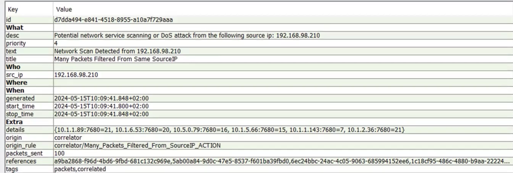

# 🌐 Network Scan Investigation – 192.168.98.210

---

## 📌 Overview
This lab demonstrates the analysis of a potential network scanning activity detected in a SIEM environment.

The alert indicates that a single internal IP address generated a high volume of traffic toward multiple internal hosts on the same port.

---

## 🧠 Executive Summary
A suspicious internal host (**192.168.98.210**) was identified sending multiple packets to different internal systems on port **7680**.

The activity pattern suggests **horizontal network scanning**, which is commonly used for reconnaissance purposes.

Since the source IP is internal, this increases the risk and may indicate a compromised device or unauthorized internal activity.

**Final Verdict: Suspicious internal activity – investigation required**

---

## 🚨 Alert Details

- **Alert Name:** Network Scan Detected  
- **Source IP:** 192.168.98.210  
- **Type:** Potential network scan / DoS behavior  
- **Priority:** Medium (4)  
- **Event Time:** 2024-05-15  

---

## 🔍 SIEM Analysis

### Key Observations:
- Large number of packets from a single source IP  
- Multiple destination IP addresses  
- Same destination port: **7680**  

### Extracted Data:
10.1.1.89:7680
10.1.6.53:7680
10.5.0.79:7680
10.1.5.66:7680
10.1.1.143:7680

---

## 🧠 Technical Analysis

The traffic pattern shows that a single internal IP address is targeting multiple hosts on the same port.

This represents a:

👉 **Horizontal Network Scan**

This type of activity is typically used to:
- discover active hosts  
- identify exposed services  
- map the internal network  

The source IP (**192.168.98.210**) is an internal/private address, which significantly increases the risk.

This may indicate:
- a compromised internal machine  
- unauthorized internal scanning  
- a misconfigured legitimate service  

---

## 🎯 MITRE ATT&CK Mapping

- **T1046 – Network Service Scanning**

---

## ⚠️ Risk Assessment

- Source IP is internal (**192.168.x.x**)  
- Activity is reconnaissance-type behavior  
- No confirmed exploitation  

**Risk Level: Medium**

---

## 🧾 Conclusion

The activity originates from an internal IP address (192.168.98.210) and shows characteristics of a potential network scan targeting multiple internal hosts on the same port (7680).

A total of 100 packets were sent to different internal IP addresses, which may indicate automated behavior.

However, the scan is limited to a single port, which is not typical for a full reconnaissance scan. This may suggest legitimate activity such as:
- internal service discovery
- automated system updates
- host availability checks

At this stage, the activity is considered **suspicious but not clearly malicious**.

### 🔒 Final Verdict:
Monitoring recommended – no immediate blocking required

### 📌 Recommended Actions:
- Identify the source device (192.168.98.210)
- Verify if the activity is related to legitimate services or updates
- Monitor for unusual patterns or expansion to multiple ports
