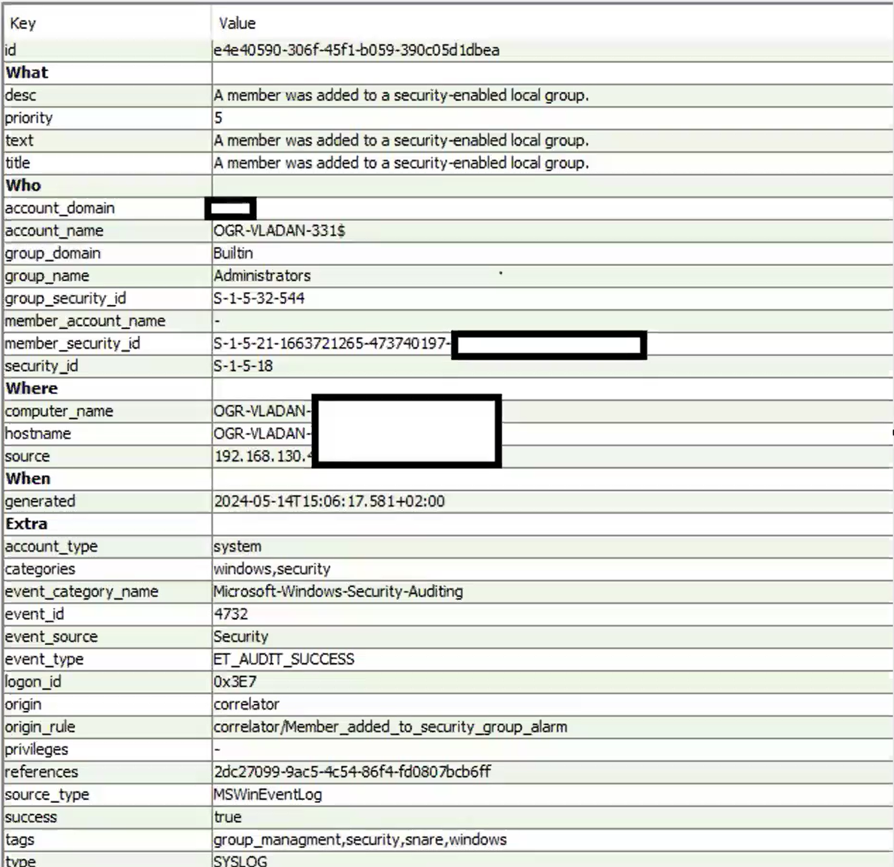

# 👤 Privilege Escalation Detection – Event ID 4732

---

## 📌 Overview

This alert shows a change in user privileges, specifically that a user was added to the Administrators group.

This type of activity is critical because it gives full control over the system.

---

## 🚨 Key Details

- **Event ID:** 4732  
- **Description:** Member added to security-enabled local group  
- **Group:** Administrators  
- **Host:** OGR-VLADAN  
- **IP Address:** 192.168.x.x (internal)  
- **Executed by:** SYSTEM (S-1-5-18)  
- **Status:** Audit Success  

---

## 🔍 Analysis

From the event, it is clear that a user was successfully added to the **Administrators group**, which means they now have full privileges on the system.

### Key observations:

- Event ID 4732 indicates a group membership change  
- Administrators is a **high-privilege group**  
- The action is associated with:
  - `OGR-VLADAN-331$` → machine account  
- The execution was done by:
  - `SYSTEM account (S-1-5-18)`  
- The added user can be identified through:
  - `member_security_id`  

The event is marked as **Audit Success**, meaning the action was completed successfully.

---

## 🧠 Interpretation

Since the action was executed by the SYSTEM account, this could indicate legitimate activity such as:

- software installation  
- system update  
- group policy changes  

However, adding a user to the Administrators group is always a **high-risk action** and must be verified.

---

## 🔎 SIEM Investigation Steps

To determine whether this activity is legitimate or not, the following should be checked:

- Identify the user via `member_security_id`  
- Check logon events (4624 / 4625)  
- Analyze process creation logs (Event 4688)  
- Review activity on the host (OGR-VLADAN)  
- Check for repeated group changes (4732 / 4733)  
- Correlate with network activity (VPN, firewall logs)  
- Verify if there is a legitimate reason (admin action or update)  

---

## 🧾 Conclusion

This event represents a **privilege escalation activity**, as a user was added to the Administrators group.

Although the action may be legitimate due to SYSTEM involvement, this type of change requires verification.

Possible scenarios include:

- legitimate administrative action  
- system update or configuration change  
- potential system compromise  
- persistence mechanism  

---

## 🔒 Final Verdict

**Suspicious – verification required**

---

## 📌 Recommendations

- Identify the user added to the group  
- Confirm if the change was authorized  
- Analyze related logs  
- Monitor system activity  
- Take action if further suspicious behavior is detected  
