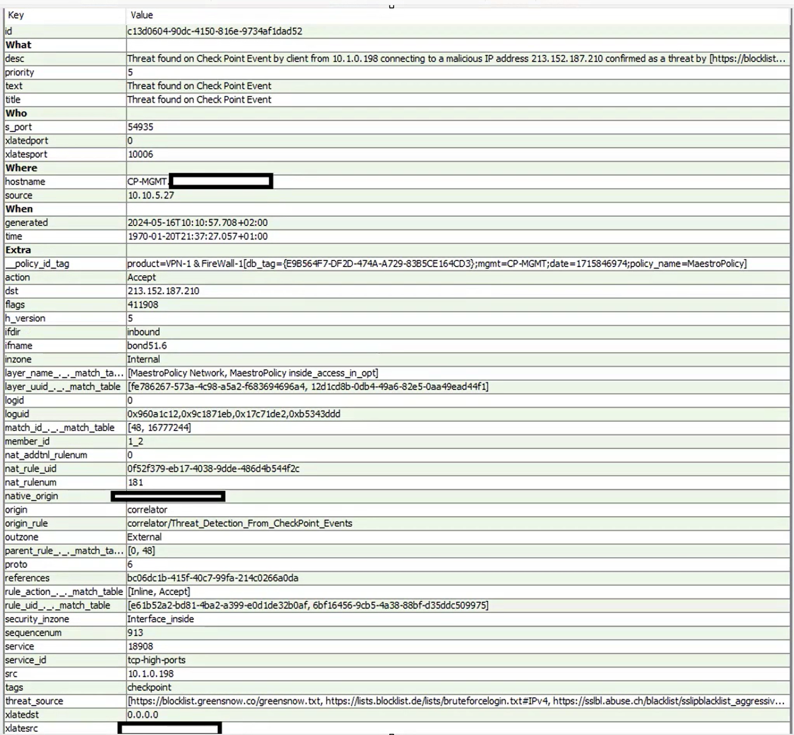

# 🚨 Threat Detection – Malicious Connection (Checkpoint Firewall)

---

## 🔍 Analysis

The alert indicates that a **threat was detected on a Check Point firewall event**, where an internal client (10.1.0.198) communicated with a known malicious IP address (213.152.187.210).

The destination IP is confirmed as malicious by multiple threat intelligence sources (blocklists such as greensnow, abuse.ch, etc.).

The connection was **allowed (action = ACCEPT)**, which is critical because it means the communication was not blocked by the firewall.

The traffic is identified as **inbound**, using high TCP ports, which may indicate suspicious or non-standard communication.

---

## 🧩 Key Observations

- Internal source IP: 10.1.0.198  
- External malicious IP: 213.152.187.210  
- Action: ACCEPT (connection allowed) ❗  
- Service: tcp-high-ports  
- Direction: inbound  
- Threat confirmed via multiple blacklist sources  
- Firewall device: Check Point (CP-MGMT)

---

## 🧠 Interpretation

This event shows that an internal host successfully communicated with a known malicious IP address.

Possible explanations include:

- Malware communication (Command & Control activity)
- Suspicious background process
- User interaction with malicious content (link, file, etc.)
- Less likely: system process or update activity

Even though benign explanations are possible, the presence of confirmed threat intelligence significantly increases the risk level.

---

## ⚠️ Conclusion

The internal host (10.1.0.198) communicated with a confirmed malicious IP address, and the connection was allowed by the firewall.

Although there is a possibility of legitimate activity, this event must be treated as **potentially malicious**.

The host should be considered **potentially compromised until further investigation proves otherwise**.

---

## 🛠️ Recommended Actions

- Investigate the host 10.1.0.198 in the SIEM  
- Check running processes and active network connections  
- Look for repeated communication with malicious IPs  
- Correlate with endpoint security tools (EDR/AV)  
- Block IP address 213.152.187.210 on the firewall  
- Monitor the host for further suspicious behavior  
