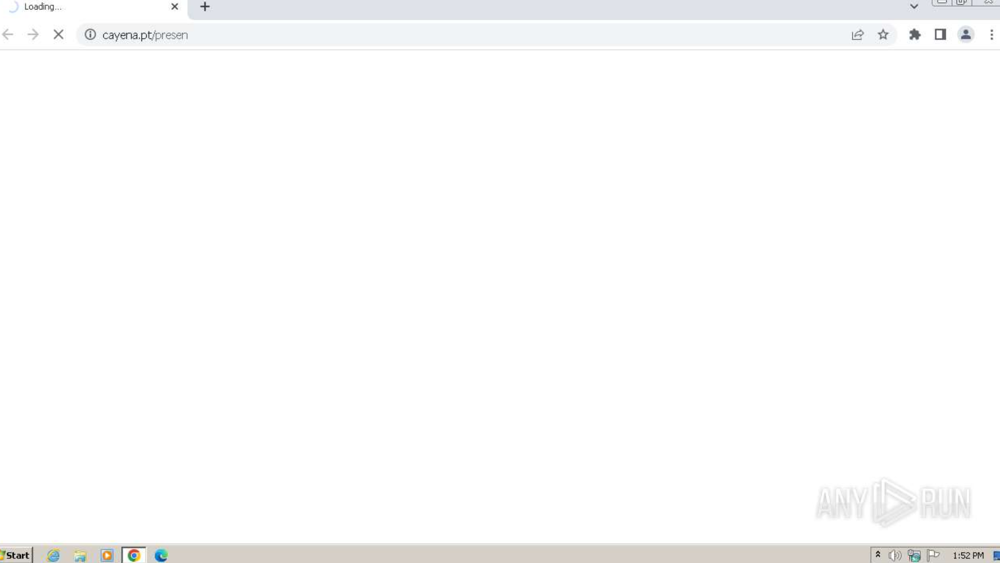
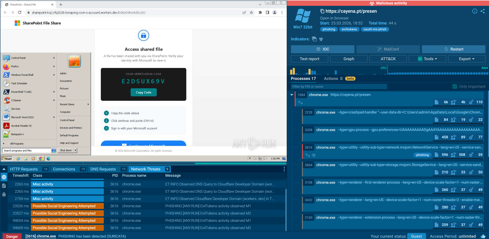
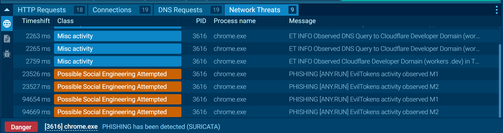
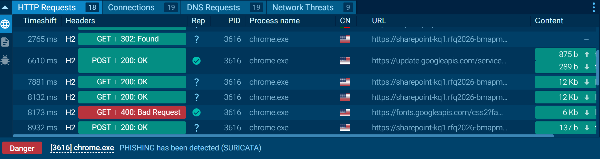
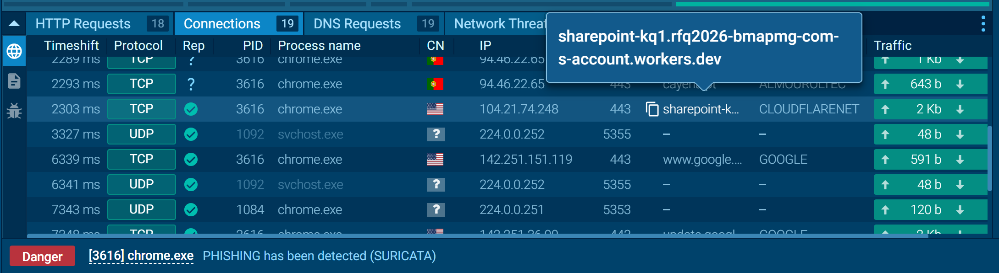

# Lab 06 - Phishing Analysis using ANY.RUN

## 📌 Overview

This lab demonstrates the analysis of a phishing attack using the :contentReference[oaicite:0]{index=0} sandbox environment.

The objective was to investigate a suspicious URL, analyze its behavior, and determine whether it is malicious based on network activity, HTTP requests, and detection alerts.

---

## 🎯 Objective

- Analyze a suspicious URL in a sandbox environment  
- Identify phishing indicators  
- Investigate network traffic and connections  
- Correlate findings with detection tools  
- Provide a final conclusion  

---

## 🔍 Analysis Process

### 1. Initial Access

The analysis started by opening a suspicious URL in the sandbox environment.

The page redirected to a fake Microsoft SharePoint login page, which is a common phishing technique used to steal user credentials.

---

### 2. Phishing Page Behavior

The page requested a verification code and prompted the user to sign in, indicating a social engineering attempt.

This behavior is consistent with phishing campaigns targeting Microsoft accounts.

---

### 3. Network Activity

The sandbox revealed connections to a suspicious domain hosted on Cloudflare infrastructure:

- sharepoint-kq1.rfq2026-bmapmg-com-s-account.workers.dev  
- IP: 104.21.74.248  

This indicates the use of cloud infrastructure for phishing delivery.

---

### 4. HTTP Traffic

The HTTP requests show:

- GET 302 Found → redirection to phishing page  
- POST 200 OK → potential submission of user data  

This confirms user interaction with the phishing page.

---

### 5. Detection Alerts

The network traffic triggered alerts from :contentReference[oaicite:1]{index=1}:

- Phishing has been detected  
- Possible Social Engineering Attempted  

These alerts support the conclusion of malicious activity.

---

## 📸 Evidence

### Initial URL

The analysis started by opening a suspicious URL.

---

### Phishing Page

The page redirected to a fake Microsoft SharePoint login page requesting user verification.

---

### ANY.RUN Analysis Overview

The sandbox environment shows process activity and confirms suspicious behavior in the browser.

---

### Network Threat Detection

Suricata detected phishing activity and social engineering attempts.

---

### HTTP Requests

HTTP traffic shows redirection (302) and POST requests, indicating possible credential submission.

---

### Network Connections

Connections to a suspicious Cloudflare domain confirm malicious infrastructure usage.

---

## 🧠 MITRE ATT&CK Mapping

- Initial Access – Phishing

---

## ✅ Conclusion

Based on the analysis, the URL is confirmed to be malicious.

The attack uses a fake Microsoft login page to perform credential harvesting through social engineering.

Network traffic, HTTP behavior, and detection alerts all indicate a phishing campaign.

---

